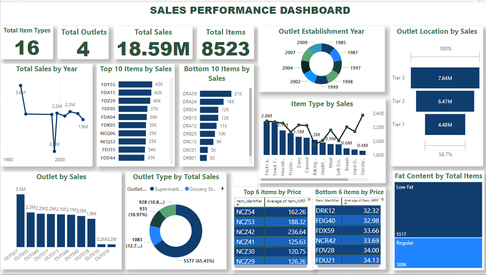

# Sales Performance Analysis

## Overview

The Sales Performance Analysis module provides insights into the sales metrics of our e-commerce platform. This analysis aims to track, evaluate, and optimize sales performance over time, enabling data-driven decisions to enhance revenue growth and customer engagement.

## Features

- **Sales Metrics Tracking**: Monitor key performance indicators (KPIs) such as total sales, average order value (AOV), conversion rates, and customer acquisition costs.
- **Trend Analysis**: Visualize sales trends over specific periods to identify peak sales times, seasonal variations, and overall growth patterns.
- **Product Performance**: Evaluate the sales performance of individual products, including bestsellers and underperformers, to inform inventory management and marketing strategies.
- **Customer Insights**: Analyze customer purchasing behaviors, demographics, and retention rates to tailor marketing campaigns and improve customer experience.
- **Interactive Dashboards**: Use visually appealing dashboards and charts to present data clearly and facilitate quick decision-making.

## Usage

To utilize the Sales Performance Analysis module:

1. **Data Integration**: Ensure your sales data is integrated from various sources (e.g., payment processors, inventory systems).
2. **Run Analysis Scripts**: Execute the provided analysis scripts to generate reports and visualizations.
3. **Review Insights**: Regularly review the generated reports to make informed decisions about product offerings, marketing strategies, and operational improvements.

## Requirements

- Python 3.x
- Pandas
- Matplotlib/Seaborn for visualizations
- Jupyter Notebook (optional for interactive analysis)

## Getting Started

1. Clone the repository:
   ```bash
   git clone https://github.com/mearbaz/Sales_Performance_Analysis.git

   

## Sales Performance Dashboard

Here’s a snapshot of our sales performance dashboard:


